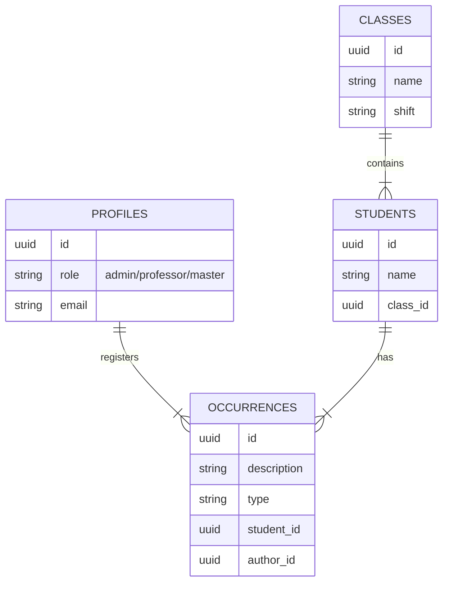

# Data Flow & Lifecycle

## Data Lifecycle

### 1. User Interaction (Client)
- **Input**: User fills forms (e.g., "Add Student", "Add Occurrence", "Login").
- **Processing**: Frontend validation (Zod/React Hook Form inferred).
- **Transport**: Data sent via fetch/axios to `app/api/*` endpoints OR directly to Supabase via `lib/supabase/client.ts`.

### 2. Processing Layer (Server/API)
- **Authentication Check**: Middleware or API route validates the Supabase Session/JWT.
- **Business Logic**:
  - `app/api/setup`: Handles initial system seeding.
  - `app/api/approve-user`: Validates permissions before changing user status.
- **Database Interaction**: Uses `lib/supabase/server.ts` to perform CRUD operations on Supabase.

### 3. Storage Layer (Database)
- **Persistence**: Data stored in PostgreSQL tables (`profiles`, `occurrences`, etc.).
- **Triggers**: Database triggers (if defined in SQL files like `supabase-schema.sql`) might auto-update timestamps or handle side effects.
- **Security Check**: Postgres RLS policies check every query to ensure the user (based on `auth.uid()`) has permission.

### 4. Output/Rendering
- **SSR**: Server Components fetch data directly from DB -> Render HTML -> Send to Client.
- **CSR**: Client Components fetch data via API/Client -> Update State -> Re-render UI.

## Storage Diagrams (Conceptual)

### Core Entities Relationship

## API Interactions

### Authentication
1. **Login**: Client -> `supabase.auth.signInWithPassword` -> Supabase Auth -> Returns Session (Cookie/Token).
2. **Session**: Next.js Middleware/Server Components read cookies to restore session.

### Data Mutation (Example: Create Occurrence)
1. **Professor** fills form on `app/professor/ocorrencias`.
2. **POST** to `app/api/occurrences` (or direct Supabase insert).
3. **RLS Policy** checks: "Is user Role = Professor? Does user teach this student's class?".
4. **Success**: Record inserted.
5. **Feedback**: UI updates with toast/notification.
